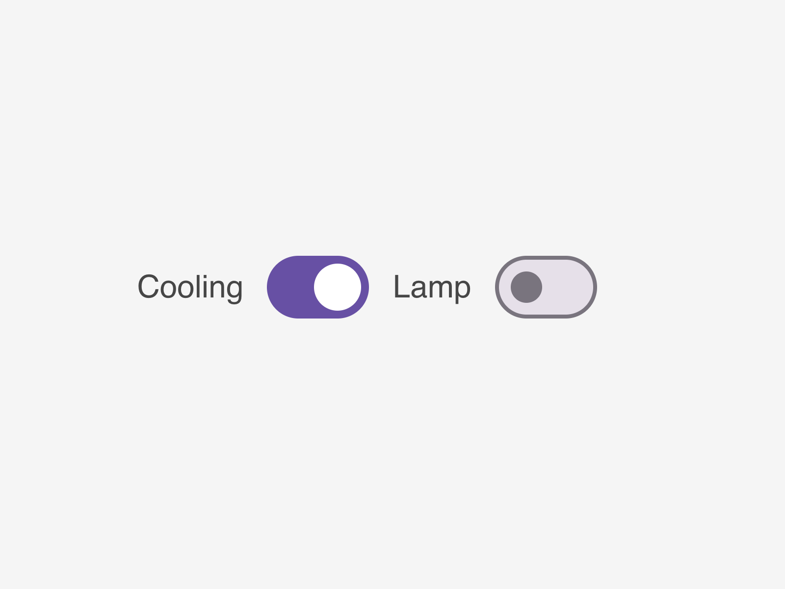

# widget-switch

IronFlock widget: A Lit 3.x web component that renders toggle switches using Material Design 3 components. Supports multiple switches with configurable state mapping and IoT device action triggers.



## Installation

```bash
npm i @record-evolution/widget-switch
```

**Peer Dependencies:** This widget requires `@material/web` to be available at runtime via import map or bundled separately.

## Usage

```html
<script type="module">
    import '@record-evolution/widget-switch'
</script>

<widget-switch-1.1.1></widget-switch-1.1.1>
```

> **Note:** The element tag includes the version number (e.g., `widget-switch-1.1.1`). This is replaced at build time via `@rollup/plugin-replace`.

## Configuration

The widget accepts an `inputData` property with the following structure:

```typescript
interface InputData {
    title?: string
    subTitle?: string
    dataseries?: Array<{
        label?: string
        value?: string
        stateMap?: {
            on: string // Value(s) representing ON state
            off: string // Value(s) representing OFF state
        }
        actionDevice?: string
        actionApp?: string
        actionTopic?: string
        styling?: {
            labelColor?: string
            valueColor?: string
        }
    }>
}
```

## State Mapping

The `stateMap` configuration determines how values are interpreted as ON/OFF states:

**Exact values:**

```json
{ "on": "true, 1, active", "off": "false, 0, inactive" }
```

**Numeric comparisons:**

```json
{ "on": ">50", "off": "<=50" }
{ "on": ">=100", "off": "<100" }
```

Supported operators: `<`, `<=`, `>`, `>=`

## Action Events

When a switch is toggled, the widget dispatches an `action-submit` custom event:

```javascript
element.addEventListener('action-submit', (e) => {
    console.log(e.detail)
    // {
    //   args: true/false,      // New switch state
    //   actionApp: "...",      // Target app
    //   actionDevice: "...",   // Target device ID
    //   actionTopic: "...",    // Action topic to call
    //   label: "..."           // Switch label
    // }
})
```

## Theming

The widget supports theming via CSS custom properties or the `theme` property:

**CSS Custom Properties:**

```css
widget-switch-1.1.1 {
    --re-text-color: #333;
    --re-tile-background-color: #fff;
}
```

**Theme Object:**

```javascript
element.theme = {
    theme_name: 'dark',
    theme_object: {
        backgroundColor: '#1a1a1a',
        title: {
            textStyle: { color: '#fff' },
            subtextStyle: { color: '#aaa' }
        }
    }
}
```

## Development

```bash
npm run start    # Dev server at localhost:8000/demo/
npm run build    # Production build to dist/
npm run types    # Regenerate TypeScript types from schema
npm run release  # Build, bump version, push to git with tag
```

## License

MIT
